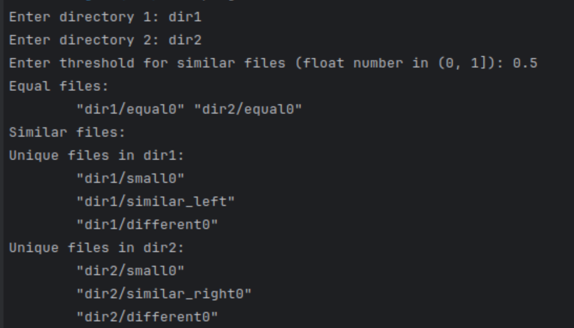

# 1C_Test_Task

Наумов Глеб Максимович

Задача №4

### Компиляция
Для запуска требуется установленная OpenSSL. 
```
mkdir build && cd build
cmake .. -DCMAKE_BUILD_TYPE=Release
make
```

Появится 2 исполняемых файла: `program` -- основная, и `generator` -- генерирует определенное число файлов в 2 директории.

### Решения
Для сравнения файлов используется хэширование. Это эвристика для случая, когда будет много одинаковых файлов. 

Для сравнения сходства используется следующий алгоритм: для первого байта меньшего файла найдем первое совпадание в большем файле. 
Далее идем посимвольно и выбираем жадно символы из большого. 

Для сравнения есть такая эвристика. Пусть требуемая доля совпадения $h$, а размеры $s_1 < s_2$. Тогда необходимо 
$\frac{s1}{s2}\geq h$.

Это может сильно сократить перебор или много файлов сильно разного размера. 

